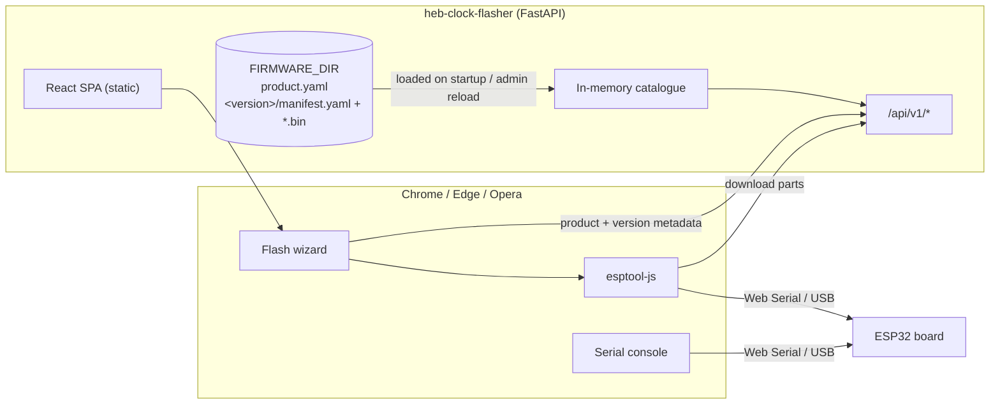

# heb-clock-flasher

A self-hosted, browser-based firmware flasher for the Hebrew e-paper clock family
([Hebrew Clock](https://github.com/t0mer/hebrew-clock),
[Hebrew Time (RTC)](https://github.com/t0mer/hebrew-time-rtc) and
[Hebrew Clock (NTP)](https://github.com/t0mer/hebrew-clock-ntp)).
Pick a product and a firmware version, plug the ESP32 board in over USB, and flash it
straight from Chrome or Edge. You don't need the Arduino IDE or a command-line esptool.
When flashing finishes, a built-in serial console shows the device's boot log.

The server is a small FastAPI app. It reads a firmware catalogue from a directory on
disk and serves it next to a React single-page app. The flashing itself runs in the
browser through the [Web Serial API](https://developer.mozilla.org/en-US/docs/Web/API/Web_Serial_API)
and [esptool-js](https://github.com/espressif/esptool-js).

[](https://hub.docker.com/r/techblog/heb-clock-flasher)
[](LICENSE)

## Table of contents

- [Features](#features)
- [Screenshots](#screenshots)
- [How it works](#how-it-works)
- [Requirements](#requirements)
- [Installation](#installation)
- [Configuration](#configuration)
- [Usage](#usage)
- [Firmware catalogue](#firmware-catalogue)
- [API reference](#api-reference)
- [Monitoring](#monitoring)
- [Security notes](#security-notes)
- [Troubleshooting](#troubleshooting)
- [Development](#development)
- [Contributing](#contributing)
- [License](#license)

## Features

- **Flash from the browser.** The browser connects to the ESP chip over Web Serial
  with esptool-js, downloads every firmware part from the server and writes it at
  the offset declared in the manifest.
- **Chip check.** The connected chip is detected and, when the detected chip name is
  recognised, compared with the firmware's `chip_family`. If they differ, flashing is
  refused. See the known issue under [Troubleshooting](#troubleshooting): for most
  chips the name is not recognised and the check is skipped.
- **Baud fallback.** The flasher always syncs with the ROM bootloader at 115200, then
  switches to the manifest's flash baud rate (921600 by default). If connecting at
  that rate fails, it retries at 115200.
- **Optional full erase** before installing.
- **Serial console** after flashing, on the same port. You can pick the baud rate
  (9600 to 921600), toggle autoscroll, and clear, copy or download the log.
- **Step-by-step wizard** (Select version → Connect → Flash → Monitor) with live
  progress for each part.
- **Product pages** built from the catalogue: Markdown summary (sanitized), feature
  list, hardware list, image gallery, version list, and links to
  the source repository and setup guide.
- **Filesystem catalogue.** You add products and versions by dropping folders into
  the firmware directory. No database and no image rebuild are needed.
- **Hot reload of the catalogue** through an optional token-protected admin endpoint.
- **ESP Web Tools manifest.** Every version is also published as an
  [ESP Web Tools](https://esphome.github.io/esp-web-tools/) compatible
  `esp-web-tools.json`.
- **Import script** that turns an Arduino build folder into a validated catalogue
  entry (`scripts/import_firmware.py`).
- **Built-in support for the ESP32, ESP32-C3, ESP32-S2, ESP32-S3, ESP32-C6, ESP32-H2 and
  ESP8266 chip families** in the catalogue model.
- **Prometheus metrics** (`/metrics`), a health endpoint (`/health`), and Swagger UI
  at `/api/docs`.
- **SEO extras:** a generated `robots.txt` and `sitemap.xml`, per-page meta and Open
  Graph tags, and optional Google Analytics 4 or Google Tag Manager injection.
- **Browser check.** Browsers without Web Serial (Firefox, Safari) and non-HTTPS
  origins get a clear explanation instead of a broken flash button.

## Screenshots

<!-- TODO: screenshot — home page, product page, flash wizard and serial console -->

## How it works



1. On startup the backend scans `FIRMWARE_DIR`. Each product folder holds a
   `product.yaml` and one folder per version with a `manifest.yaml` and the `.bin`
   parts. Every manifest is validated (version format, chip family, parts with no
   duplicate offsets, and part files that exist on disk). A version that fails
   validation is skipped and a warning is logged.
2. The SPA lists the products. On the flash page you pick a version and click
   **Connect & flash**, and the browser asks you to choose a serial port.
3. esptool-js syncs with the ROM bootloader and detects the chip. It then downloads each
   part from `/api/v1/products/{slug}/versions/{version}/parts/{file}` and writes
   it with compression, then hard-resets the board.
4. The port is handed to the serial console, which shows the device's output.

Part downloads only serve files that are listed in the manifest of a version in the
catalogue. User input is never used directly to build a filesystem path.

## Requirements

**To flash a device (end users)**

- A Chromium-based desktop browser with Web Serial: Google Chrome 89+, Microsoft
  Edge 89+ or Opera 75+. Firefox and Safari are not supported.
- A secure context: the site must be served over **HTTPS**, or opened on
  `localhost` / `127.0.0.1`.
- A USB data cable to the board. Boards with native USB (for example the XIAO
  ESP32-C3/S3) need no driver. Boards with a CH340 or CP210x USB-serial chip may need
  the vendor's driver installed in the operating system. If the board does not enter download mode by
  itself, hold **BOOT** and tap **RESET**.

**To host the server**

- Docker, or Python 3.12+ and Node.js 20.19+ (or 22.12+) to build from source.
- A firmware directory with at least one product (see
  [Firmware catalogue](#firmware-catalogue)).
- A reverse proxy that terminates TLS (nginx, Caddy, Traefik and so on) for any
  deployment that is not on localhost.

## Installation

### Docker

The image is published on Docker Hub as
[`techblog/heb-clock-flasher`](https://hub.docker.com/r/techblog/heb-clock-flasher)
for `linux/amd64` and `linux/arm64`.

```bash
docker run -d --name heb-clock-flasher \
  -p 8080:8080 \
  -v "$(pwd)/firmware:/app/firmware" \
  techblog/heb-clock-flasher:latest
```

The image ships **without firmware**. You must mount a firmware directory at
`/app/firmware`. The `firmware/` folder in this repository contains only the
`product.yaml` and `manifest.yaml` files, because the `.bin` files are gitignored.
Add the binaries yourself (see [Adding a firmware version](#adding-a-firmware-version)).

The container listens on port **8080** and runs as a non-root user (UID 10001). The
mounted directory must be readable by that user. A `HEALTHCHECK` polls `/health`.

### Docker Compose

`docker-compose.yml` builds the image from this repository and mounts `./firmware`:

```bash
git clone https://github.com/t0mer/heb-clock-flasher.git
cd heb-clock-flasher
docker compose up -d --build
```

> The compose file tags the image as `techblog/esp-web-flasher:latest`, which is not a
> published image, so the `--build` flag is needed. To use the published image instead,
> change `image:` to `techblog/heb-clock-flasher:latest` and remove the `build:` block.

Then open <http://localhost:8080>. For access from other machines, put the container
behind an HTTPS reverse proxy, because Web Serial does not work on plain HTTP.

### From source

```bash
git clone https://github.com/t0mer/heb-clock-flasher.git
cd heb-clock-flasher

# 1. Build the SPA (output goes to backend/static)
cd frontend
npm ci
npm run build
cd ..

# 2. Run the backend
cd backend
python3.12 -m venv .venv && . .venv/bin/activate
pip install -r requirements.txt
FIRMWARE_DIR=../firmware uvicorn app.main:app --host 0.0.0.0 --port 8080
```

`STATIC_DIR` defaults to `./static`, which is `backend/static` when you start the
server from `backend/`.

## Configuration

All settings are read from environment variables (case-insensitive) through
`pydantic-settings`. A `.env` file in the working directory is loaded too. Real
environment variables take precedence over `.env`, which takes precedence over the
built-in defaults.

| Variable | Default | Docker image default | Description |
|---|---|---|---|
| `FIRMWARE_DIR` | `./firmware` | `/app/firmware` | Root of the firmware catalogue. Startup fails if it does not exist. |
| `STATIC_DIR` | `./static` | `/app/static` | Directory with the built SPA (`index.html` plus assets). |
| `PORT` | `8080` | `8080` | Listening port when the server is started with `python -m app.main`. The Docker image and the `uvicorn` command line use `--port 8080` and ignore this value. |
| `LOG_LEVEL` | `info` | `info` | Loguru log level (`debug`, `info`, `warning`, `error`, …). |
| `FAIL_ON_EMPTY` | `true` | `true` | Refuse to start when no valid product is found. Set it to `false` to allow an empty catalogue. |
| `ADMIN_TOKEN` | *(empty)* | *(empty)* | Bearer token for `POST /api/v1/admin/reload`. When it is empty, the endpoint returns `403`. |
| `CORS_ORIGINS` | *(empty)* | *(empty)* | Comma-separated list of allowed origins. Only needed when the SPA is served from a different origin than the API. When it is empty, no CORS middleware is added. |
| `SITE_URL` | *(empty)* | *(empty)* | Public base URL (for example `https://flash.example.com`), used in `robots.txt` and `sitemap.xml`. Falls back to `https://example.com`. |
| `GOOGLE_TAG_ID` | *(empty)* | *(empty)* | Optional Google Analytics 4 (`G-…`) or Google Tag Manager (`GTM-…`) ID. It is injected into `index.html` server-side. Invalid IDs are ignored. |

## Usage

1. Open the site in Chrome, Edge or Opera over HTTPS (or on `localhost`).
2. On the home page, choose a product, for example **Hebrew Clock (NTP)**. The product
   page shows the hardware list, features, version history and links to the setup guide.
3. Click through to the flash page. Pick a firmware version. The newest is marked
   **latest**, and each version shows its chip family, flash and console baud rates,
   and any notes.
4. Optionally turn on **Erase flash before installing**.
5. Click **Connect & flash** and select the board's serial port in the browser dialog.
6. Watch the progress: connect, detect chip, download each part, flash and reset. If
   the chip cannot be synced, hold **BOOT**, tap **RESET** and try again.
7. When flashing is done, the serial console on the right shows the boot log. Use
   **Flash again** to repeat the process.

## Firmware catalogue

### Layout

```
firmware/
└── <product-slug>/
    ├── product.yaml
    ├── images/…                 # optional, for relative image paths
    └── <YYYY.M.PATCH>/
        ├── manifest.yaml
        ├── bootloader.bin
        ├── partitions.bin
        ├── boot_app0.bin
        └── app.bin
```

Loading rules:

- Products are sorted by `order`, then by `slug`. Versions are sorted newest first
  by numeric `YYYY.M.PATCH`.
- The folder name is the slug. If `slug` in `product.yaml` differs, the folder
  name is used and a warning is logged.
- An invalid `product.yaml` skips the whole product. An invalid `manifest.yaml`
  or a missing part file skips only that version.

The catalogue in this repository currently defines three products, each with a
`2026.6.0` manifest for `esp32c3`:

| Slug | Product | Source |
|---|---|---|
| `hebrew-clock` | Hebrew Clock (server-rendered, Wi-Fi) | [t0mer/hebrew-clock](https://github.com/t0mer/hebrew-clock) |
| `hebrew-time-rtc` | Hebrew Time (RTC), fully offline | [t0mer/hebrew-time-rtc](https://github.com/t0mer/hebrew-time-rtc) |
| `hebrew-clock-ntp` | Hebrew Clock (NTP) | [t0mer/hebrew-clock-ntp](https://github.com/t0mer/hebrew-clock-ntp) |

### `product.yaml`

```yaml
slug: hebrew-clock-ntp            # required
name: "Hebrew Clock (NTP)"        # required
tagline: "One-line description"
summary: |                        # Markdown, rendered sanitized on the product page
  Longer description…
repo: "https://github.com/t0mer/hebrew-clock-ntp"
license: "Apache-2.0"             # default: Apache-2.0
chip_families: [esp32c3, esp32s3] # esp32 | esp32c3 | esp32s2 | esp32s3 | esp32c6 | esp32h2 | esp8266
hardware:
  - "Seeed Studio XIAO ESP32 (C3 or S3 variant)"
images:                           # absolute URLs, or paths relative to the product folder
  - "https://raw.githubusercontent.com/…/device-clock.jpeg"
features:
  - "Automatic time sync over NTP"
links:
  setup_guide: "https://github.com/t0mer/hebrew-clock-ntp#readme"
order: 3                          # sort key on the home page (default: 0)
```

### `manifest.yaml`

```yaml
version: 2026.6.0                 # required, must match YYYY.M.PATCH and should match the folder name
chip_family: esp32c3              # required
released: '2026-06-20'
changelog: Initial public release.
notes: ''                         # shown on the flash page
console:
  baud: 115200                    # default serial console baud
flash:
  baud: 921600                    # preferred flashing baud (falls back to 115200)
  erase_before: false             # used as new_install_prompt_erase in esp-web-tools.json
parts:                            # required; offsets are hex strings with a 0x prefix or decimal integers ('8000' means 8000, not 0x8000); no duplicates
  - { file: bootloader.bin, offset: '0x0' }
  - { file: partitions.bin, offset: '0x8000' }
  - { file: boot_app0.bin,  offset: '0xe000' }
  - { file: app.bin,        offset: '0x10000' }
```

Default offsets per chip (from `backend/app/catalog/offsets.py`):

| Chip family | bootloader | partitions | boot_app0 | app |
|---|---|---|---|---|
| `esp32c3`, `esp32s3`, `esp32c6`, `esp32h2` | `0x0` | `0x8000` | `0xe000` | `0x10000` |
| `esp32`, `esp32s2` | `0x1000` | `0x8000` | `0xe000` | `0x10000` |
| `esp8266` | – | – | – | `0x0` (single image) |

### Adding a firmware version

Use the import script to turn an Arduino build folder (`*.bootloader.bin`,
`*.partitions.bin` and the application `*.bin`) into a catalogue entry. The product
folder with its `product.yaml` must already exist.

```bash
python scripts/import_firmware.py \
  --product hebrew-clock-ntp \
  --version 2026.6.1 \
  --chip esp32c3 \
  --build-dir /path/to/arduino/build \
  --arduino-core ~/.arduino15/packages/esp32/hardware/esp32/<core-version> \
  --changelog "Fix quarter-hour wording"
```

| Option | Description |
|---|---|
| `--product` | Product slug (required, must exist under `--firmware-dir`). |
| `--version` | `YYYY.M.PATCH` (required). |
| `--chip` | Chip family (required). |
| `--build-dir` | Arduino build output folder (required). |
| `--arduino-core` | Arduino ESP32 core folder, used to find `tools/partitions/boot_app0.bin`. |
| `--boot-app0` | Explicit path to `boot_app0.bin` (overrides `--arduino-core`). |
| `--firmware-dir` | Catalogue root (default `./firmware`). |
| `--merge` | Merge all parts into one `merged.bin` at `0x0` with `esptool merge_bin` (needs `pip install esptool`). |
| `--force` | Overwrite an existing version folder. |
| `--baud` / `--console-baud` | Flash and console baud rates (defaults 921600 and 115200). |
| `--released` | Release date `YYYY-MM-DD` (default: today). |
| `--changelog` / `--notes` | Release notes, and user-facing notes shown on the flash page. |

`boot_app0.bin` is looked up in this order: `--boot-app0`, then `--build-dir`, then
`--arduino-core`. The script copies the parts under their canonical names, writes
`manifest.yaml`, and validates the result with the same models the server uses.

The script finds the backend package relative to its own location, so it can be run
from anywhere with the backend dependencies installed
(`pip install -r backend/requirements.txt`). `--firmware-dir` defaults to `./firmware`,
so either run it from the repository root or pass `--firmware-dir` explicitly.

After you add files, restart the server or call the reload endpoint:

```bash
curl -X POST -H "Authorization: Bearer $ADMIN_TOKEN" http://localhost:8080/api/v1/admin/reload
```

## API reference

Interactive documentation (Swagger UI) is served at **`/api/docs`**. No authentication
is required except for the admin endpoint.

| Method | Path | Description |
|---|---|---|
| `GET` | `/health` | `{"status":"ok","version":…,"products":N,"versions":N}`. `version` is currently always `"dev"` (hardcoded in `main.py`; the image's `APP_VERSION` is not read) |
| `GET` | `/metrics` | Prometheus metrics |
| `GET` | `/api/v1/products` | List products (summary and latest version) |
| `GET` | `/api/v1/products/{slug}` | Product detail with version list |
| `GET` | `/api/v1/products/{slug}/versions` | Versions of a product |
| `GET` | `/api/v1/products/{slug}/versions/{version}` | One version: parts (hex offsets), flash and console config, notes |
| `GET` | `/api/v1/products/{slug}/versions/{version}/parts/{file}` | Download a firmware part. Cached as immutable for one year, with `ETag` / `If-None-Match` (304) support |
| `GET` | `/api/v1/products/{slug}/versions/{version}/esp-web-tools.json` | ESP Web Tools install manifest |
| `GET` | `/api/v1/products/{slug}/images/{file:path}` | Product image (only paths listed in `images`) |
| `GET` | `/api/v1/config` | Public config (`google_tag_id`, `site_url`). Not used by the bundled SPA |
| `POST` | `/api/v1/admin/reload` | Re-scan `FIRMWARE_DIR`. Needs `Authorization: Bearer <ADMIN_TOKEN>`. Returns `403` when no token is configured and `401` for a wrong token |
| `GET` | `/robots.txt`, `/sitemap.xml` | Generated from `SITE_URL` and the catalogue |

Any other path serves the SPA (`index.html`), so client-side routes such as
`/products/{slug}/flash` work when the page is reloaded.

Example:

```bash
curl -s http://localhost:8080/api/v1/products/hebrew-clock-ntp/versions/2026.6.0
```

```json
{
  "version": "2026.6.0",
  "chip_family": "esp32c3",
  "released": "2026-06-20",
  "changelog": "Initial public release.",
  "console": { "baud": 115200 },
  "flash": { "erase_before": false, "baud": 921600 },
  "parts": [
    { "file": "bootloader.bin", "offset": "0x0" },
    { "file": "partitions.bin", "offset": "0x8000" },
    { "file": "boot_app0.bin", "offset": "0xe000" },
    { "file": "app.bin", "offset": "0x10000" }
  ],
  "notes": ""
}
```

## Monitoring

`/metrics` exposes the following Prometheus metrics:

| Metric | Type | Labels | Description |
|---|---|---|---|
| `esp_flasher_app_info` | Info | `version` | Build info (currently always `dev`) |
| `esp_flasher_catalog_products_total` | Gauge | – | Products in the catalogue |
| `esp_flasher_catalog_versions_total` | Gauge | – | Firmware versions across all products |
| `esp_flasher_part_downloads_total` | Counter | `product`, `version`, `file` | Firmware part downloads |
| `esp_flasher_http_request_duration_seconds` | Histogram | `method`, `path`, `status` | HTTP request latency |

## Security notes

- **Serve over HTTPS.** Web Serial only works in a secure context. Terminate TLS in a
  reverse proxy in front of the container.
- **Firmware files are whitelisted.** Parts and images are served only when they are
  listed in the catalogue. The SPA fallback also checks that resolved paths stay inside
  `STATIC_DIR`.
- **The admin reload endpoint is off by default.** If you enable it, use a long random
  `ADMIN_TOKEN` and keep the endpoint behind HTTPS.
- **`/metrics` and `/api/docs` are public.** Restrict them at the reverse proxy if you
  don't want them exposed.
- **The container runs as a non-root user** (UID 10001).
- **Product summaries are rendered with `rehype-sanitize`,** so Markdown in
  `product.yaml` cannot inject scripts. The `GOOGLE_TAG_ID` value is checked against
  a strict pattern before it is injected.
- Only publish firmware you trust. The browser flashes whatever the catalogue serves.

## Troubleshooting

| Symptom | Cause / fix |
|---|---|
| Container exits on start with `No valid products found` | The mounted `FIRMWARE_DIR` has no valid `product.yaml`. Add a product or set `FAIL_ON_EMPTY=false`. |
| Startup fails with `FIRMWARE_DIR … does not exist` | Mount or create the firmware directory. |
| A product shows no versions | The version was skipped. Usually a `.bin` listed in `manifest.yaml` is missing (the binaries are not in git), or the manifest is invalid. Check the server log for warnings. |
| "HTTPS Required" page | You opened the site over plain HTTP on a host other than localhost. Use HTTPS. |
| "Browser Not Supported" page | Firefox or Safari. Use Chrome, Edge or Opera on desktop. |
| `Failed to sync with chip` | The board is not in download mode. Hold **BOOT**, tap **RESET** and retry. Also check that the USB cable carries data. |
| `Chip mismatch: …` | The connected board's chip differs from the firmware's `chip_family`. Pick the right product or version. |
| `SPA not built yet` | `STATIC_DIR` has no `index.html`. Run `npm run build` in `frontend/`. |
| Chip mismatch not detected (known issue) | esptool-js reports names such as `ESP32-C3 (revision N)`, `ESP8266EX` or `ESP32-D0WD…`, which don't match the flasher's lookup table, so the chip check is skipped for most chips (it works for ESP32-S3, S2 and H2). Make sure you picked the right product. |
| `esp-web-tools.json` lists `http://` part URLs behind an HTTPS proxy | Part URLs are built from the request's base URL. Start uvicorn with `--forwarded-allow-ips` (and `--proxy-headers`) so it trusts `X-Forwarded-Proto` from the proxy. The Docker `CMD` doesn't set this. |

## Development

### Project layout

```
backend/
  app/
    main.py            FastAPI app, SPA fallback, /health, /metrics
    core/              settings (pydantic-settings) and logging (loguru)
    catalog/           models, filesystem loader, in-memory store, offset table
    api/v1/            products, firmware parts, admin reload, config, robots/sitemap
    metrics.py         Prometheus collectors
  tests/               pytest suite (API, loader, import script)
frontend/
  src/pages/           HomePage, ProductPage, FlashPage
  src/components/      Navbar, SerialConsole, BrowserSupportGate, Layout
  src/lib/             webserial port manager, esptool-js flasher, serial console, SEO
firmware/              catalogue metadata (binaries are gitignored)
scripts/               import_firmware.py, next-version.sh
Dockerfile             Node 20 UI build, then python:3.12-slim runtime
docker-compose.yml
.github/workflows/     release.yml, docker.yml (Docker Hub), publish-ghcr.yml (manual)
```

### Backend

```bash
cd backend
pip install -r requirements.txt pytest==8.3.3 pytest-asyncio==0.24.0
pytest                              # or: uv run pytest (dev dependencies are in pyproject.toml)
FIRMWARE_DIR=../firmware LOG_LEVEL=debug uvicorn app.main:app --reload --port 8080
```

Ruff and mypy are configured in `backend/pyproject.toml` (`ruff check .`, `mypy app`).

### Frontend

```bash
cd frontend
npm ci
npm run dev          # Vite on http://localhost:5173, proxies /api, /health and /metrics to :8080
npm run lint         # currently broken: --ext is not valid with the eslint 9 flat config
npm run typecheck
npm run build        # outputs to ../backend/static
```

### Releases

- **Release** (`release.yml`, manual): creates a version tag and a GitHub Release.
- **Docker Build** (`docker.yml`): runs after a successful Release or manually. It
  builds `linux/amd64` and `linux/arm64` images and pushes
  `techblog/heb-clock-flasher:latest` and `:<tag>` to Docker Hub.
- **Publish to GHCR** (`publish-ghcr.yml`, manual): builds for amd64, arm64 and
  arm/v7 and pushes to `ghcr.io/t0mer/heb-clock-flasher`.
  <!-- TODO: verify — no public GHCR package was found at the time of writing -->

## Contributing

Issues and pull requests are welcome. For code changes, please run the backend tests
(`pytest`) and the frontend type check (`npm run typecheck`) before opening a PR.
`npm run lint` currently fails because its `--ext` flag is not supported by the
eslint 9 flat config. To add a new
device to the flasher, open a PR that adds its `product.yaml` and version manifests.
The firmware source itself lives in the device's own repository.

## License

Licensed under the [Apache License 2.0](LICENSE).
